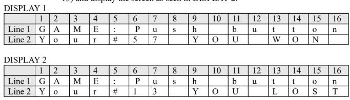

# Lab 05 – Multiplexed 7-Segment Display Counter

This laboratory experiment implements a 4-digit multiplexed 7-segment display counter on a PIC 8-bit microcontroller. The counter increments every second using software delay and resets after reaching a defined upper limit (121).



## 🔧 Environment

* **Microcontroller:** PIC16F877A
* **Architecture:** 8-bit
* **Language:** PIC Assembly
* **Assembler:** MPLAB XC8 (pic-as)
* **Simulation:** PICSimLab
* **Clock Frequency:** ~4 MHz

## 🧮 Implemented Concepts

The following low-level tasks are implemented step-by-step:

### 1. 7-Segment Display Lookup Table
* **Segment Encoding:** A `getDisplayNumber` lookup table maps digits $0$–$F$ (hexadecimal) to their 7-segment representations using `RETLW` instructions and computed `GOTO` via `ADDWF PCL`.
* **Segment Mapping (active-high):**

| Digit | Binary     | Segments |
|-------|-----------|----------|
| 0     | `11111100` | a b c d e f |
| 1     | `01100000` | b c |
| 2     | `11011010` | a b d e g |
| 3     | `11110010` | a b c d g |
| 4     | `01100110` | b c f g |
| 5     | `10110110` | a c d f g |
| 6     | `10111110` | a c d e f g |
| 7     | `11100000` | a b c |
| 8     | `11111110` | a b c d e f g |
| 9     | `11110110` | a b c d f g |

### 2. 4-Digit Multiplexing
* **Time-Division Multiplexing:** The four 7-segment displays share a common data bus (`PORTD`). Each digit is activated individually via `PORTB` upper nibble pins, one at a time in rapid succession.
* **Digit Select Lines (PORTB):**

| PORTB Bit | Digit Position |
|-----------|---------------|
| RB4       | Ones          |
| RB5       | Tens          |
| RB6       | Hundreds      |
| RB7       | Thousands     |

* **Refresh Cycle:** Each of the 4 digits is displayed for ~5 ms, giving a total refresh period of ~20 ms (~50 Hz), which appears flicker-free to the human eye.

### 3. BCD Counter with Carry Propagation
* **Ones → Tens → Hundreds:** Each digit variable (`DigitOnes`, `DigitTens`, `DigitHundreds`) is individually incremented. When a digit reaches 10, it resets to 0 and the next digit is incremented (carry propagation).
* **Upper Limit:** The counter resets to `0000` when it reaches **121** (checked by comparing `DigitHundreds=1`, `DigitTens=2`, `DigitOnes=1`).

### 4. Software Timing
* **~5 ms Delay:** A nested loop subroutine (`delay5ms`) provides the per-digit display time.
* **1-Second Tick:** The main loop cycles through all 4 digits **50 times** ($4 \times 5\,\text{ms} \times 50 = 1000\,\text{ms}$) before incrementing the counter. A `SecCounter` variable tracks the 50 iterations.

## 🚥 Display Behavior

1. **Power-on:** All digits show `0000`.
2. **Every ~1 second:** The counter increments by 1.
3. **Counting sequence:** `0000 → 0001 → 0002 → ... → 0099 → 0100 → ... → 0120 → 0000` (resets at 121).
4. **Multiplexing** is continuous — all 4 digits appear to be lit simultaneously due to persistence of vision.

## 🗺️ Memory Map

| Address | Variable        | Description                        |
|---------|-----------------|------------------------------------|
| 0x20    | DigitNum        | Current digit selector (1–4)       |
| 0x21    | DigitOnes       | Ones digit value (0–9)             |
| 0x22    | DigitTens       | Tens digit value (0–9)             |
| 0x23    | DigitHundreds   | Hundreds digit value (0–9)         |
| 0x24    | DigitThousands  | Thousands digit value (always 0)   |
| 0x25–26 | delay5ms_temp   | Delay loop counters                |
| 0x27    | number          | (Reserved)                         |
| 0x28    | SecCounter      | Counts 50 refresh cycles = 1 sec   |

## 📝 Algorithm Summary (Pseudocode)

```
ones = 0, tens = 0, hundreds = 0, thousands = 0
secCounter = 50

while true:
    for digit in [ones, tens, hundreds, thousands]:
        write segment_lookup[digit] to PORTD
        activate corresponding digit select on PORTB
        delay 5ms
        deactivate digit

    secCounter--
    if secCounter == 0:
        secCounter = 50
        ones++
        if ones == 10:
            ones = 0, tens++
            if tens == 10:
                tens = 0, hundreds++
        if hundreds==1 AND tens==2 AND ones==1:
            reset all to 0
```

## 📝 Notes

* **I/O Configuration:** `PORTD` (all output) drives the 7-segment data lines. `PORTB` upper nibble (RB4–RB7) is output for digit selection; lower nibble (RB0–RB3) is input.
* **No Thousands Overflow:** `DigitThousands` is never incremented because the counter resets at 121, so it always stays at 0.
* **Computed GOTO:** The lookup table uses `ADDWF PCL` for fast, table-driven segment decoding. Care must be taken that the table does not cross a 256-byte page boundary.
* **Verification:** All logic was verified using **PICSimLab** to confirm correct counting, multiplexing, and reset behavior.
